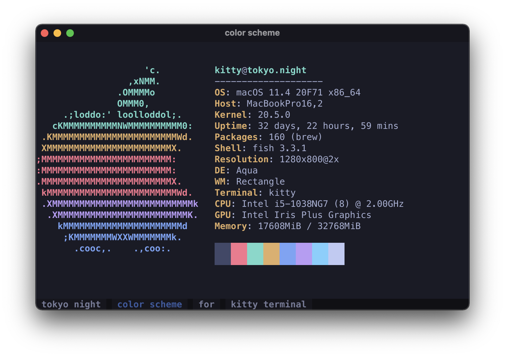

# Tokyo Night kitty theme

A clean, dark [kitty terminal](https://sw.kovidgoyal.net/kitty/) color scheme that celebrates the lights of [Downtown Tokyo at night](https://www.google.com/search?q=tokyo+night&newwindow=1&sxsrf=ACYBGNRiOGCstG_Xohb8CgG5UGwBRpMIQg:1571032079139&source=lnms&tbm=isch&sa=X&ved=0ahUKEwiayIfIhpvlAhUGmuAKHbfRDaIQ_AUIEigB&biw=1280&bih=666&dpr=2).

Adapted from the original, [Visual Studio Code theme](https://github.com/enkia/tokyo-night-vscode-theme).

